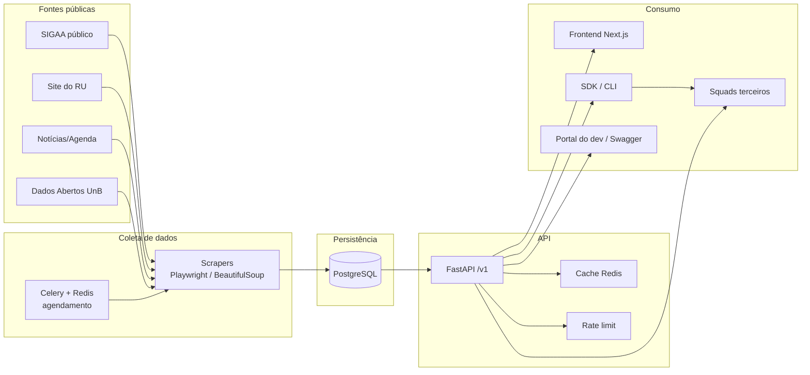
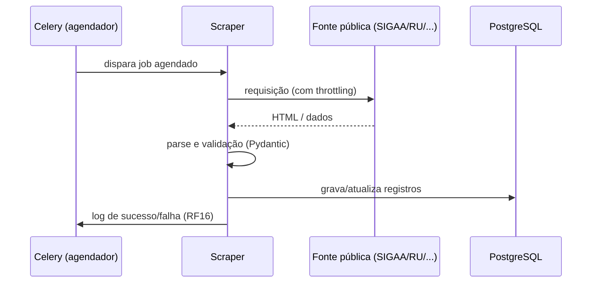

# Arquitetura — Cerradinho

API pública que consolida dados institucionais da UnB (disciplinas, professores, salas/prédios, cardápio do RU, eventos e editais) hoje espalhados em vários sistemas.

## Visão geral



## Fluxo de coleta de dados



## Componentes

| Componente | Responsabilidade | Tecnologia |
|---|---|---|
| Scrapers | Captura de dados das fontes públicas | Playwright, BeautifulSoup |
| Agendador | Dispara scrapers periodicamente, controla filas e retries | Celery, Redis |
| Banco de dados | Armazena os dados normalizados dos 5 domínios | PostgreSQL, SQLAlchemy, Alembic |
| API | Expõe os dados via REST, versionada | FastAPI |
| Cache | Reduz carga no banco para consultas frequentes | Redis |
| Rate limit | Protege a API de abuso | slowapi |
| Frontend | Interface de consulta e demonstração da API | Next.js |
| Portal do desenvolvedor | Documentação interativa | Swagger/OpenAPI |
| SDK/CLI | Facilita integração de squads futuros | Python (Typer) |
| Observabilidade | Monitoramento de uptime e alertas | UptimeRobot |
| Análise estática de segurança | SAST — bloqueia lançamento de nota se achado crítico/alto (RNF08) | a definir (ex: Bandit, Semgrep) |

## Estrutura de pastas (monorepo)

```
G3-2026-2/
├── backend/
│   ├── app/
│   │   ├── scrapers/        # um módulo por domínio
│   │   ├── models/          # SQLAlchemy
│   │   ├── schemas/         # Pydantic (request/response da API)
│   │   ├── domain/          # lógica de negócio cross-domínio (ex: salas vazias, agenda do professor)
│   │   ├── routers/         # endpoints por domínio, sob /v1
│   │   ├── tasks/           # jobs Celery
│   │   └── core/            # config, cache, rate limit
│   ├── alembic/              # migrations
│   └── tests/
├── frontend/
│   ├── app/                  # páginas Next.js
│   ├── components/
│   └── hooks/                 # lógica de chamada de API isolada dos componentes visuais
├── sdk/                       # pacote Python instalável
├── docs/                      # documentação do projeto
├── .github/
│   └── workflows/             # pipeline de CI/CD (RNF08)
├── docker-compose.yml
└── README.md
```

## Padrões de código

Adaptado de diretrizes de Clean Architecture/DDD para a stack do projeto (Python/FastAPI no backend, Next.js no frontend).

### Princípios gerais

- **Early return**: preferir retorno antecipado a condicionais aninhadas
- Evitar duplicação — extrair lógica repetida em funções/módulos reutilizáveis
- Funções com mais de ~50 linhas ou arquivos com mais de ~200 linhas devem ser quebrados
- Funções e responsabilidades bem definidas, uma coisa por função

### Preferir bibliotecas prontas a código próprio

- Antes de escrever algo do zero, checar se existe pacote no PyPI/npm que resolve
- Exemplos aplicados ao projeto: usar `slowapi` para rate limit em vez de implementar na mão; usar `schemathesis` para testes de contrato em vez de escrever validação de schema manual; usar `Typer` para o CLI em vez de parsear argumentos na mão
- Código próprio se justifica quando: é lógica de negócio específica do domínio (ex: lógica de "salas vazias"), é caminho crítico de performance, ou nenhuma lib existente atende

### Separação de responsabilidades (Clean Architecture aplicada)

- **Scrapers** não devem conter lógica de API, e **routers** não devem conter lógica de scraping — cada scraper só sabe capturar e validar dado da fonte; cada router só sabe expor e formatar resposta
- Lógica de negócio (ex: cálculo de "salas vazias", normalização de nome de professor) fica em camada própria (`app/domain/` ou `app/services/`), não dentro do router nem do scraper
- Queries de banco não ficam soltas em endpoint — passam por uma camada de repositório/model (SQLAlchemy)
- No frontend, lógica de chamada de API fica isolada em hooks/serviços, não misturada com componentes visuais

### Nomenclatura

- Evitar nomes genéricos (`utils.py`, `helpers.py`, `common.py`) como repositório de funções não relacionadas
- Preferir nomes de domínio: `SalaService`, `DisciplinaScraper`, `ProfessorAgendaQuery`, em vez de `utils.py` com funções soltas
- Um módulo, um propósito claro

### Qualidade

- Tratamento de erro explícito (try/except tipado, não capturar `Exception` genérica sem necessidade)
- Nesting máximo de ~3 níveis — se passar disso, extrair função
- Evitar lógica de negócio duplicada entre scraper e endpoint (ex: normalização de nome de professor deve existir em um único lugar, reaproveitado por quem precisar)

## Decisões de arquitetura

Decisões relevantes ficam registradas individualmente como ADR em `docs/adr/` (formato descrito em [`PROCESSO.md`](PROCESSO.md)). Resumo das decisões já tomadas:

- API versionada desde o início (`/v1/`)
- Scraping e API desacoplados (scrapers gravam no banco, API só lê)
- Sala derivada do scraper de Disciplinas, sem scraper próprio (ver RF05 em [`REQUISITOS.md`](REQUISITOS.md))
- Cache e rate limit na camada da API, não no banco
